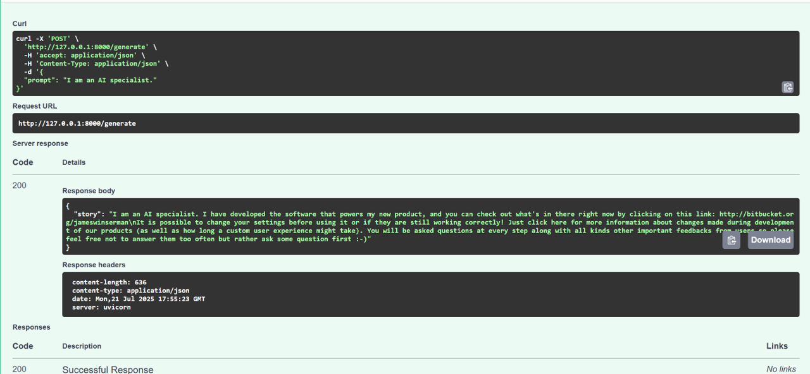
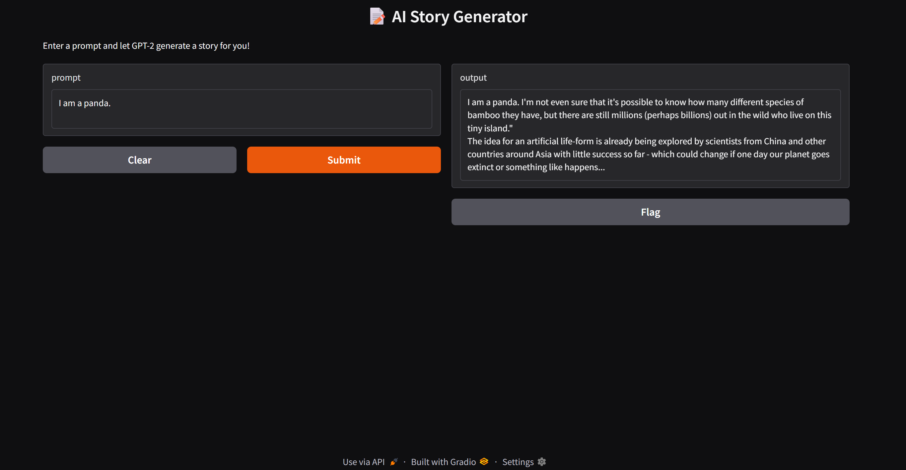

# 🤖 AI Story Generator using GPT-2

This project is part of my **Generative AI Engineering Portfolio**. It uses **GPT-2** via Hugging Face Transformers to generate short creative stories based on user-provided prompts.

---

## 📌 Project Overview

The project is built in three progressive phases:

1. **Phase 1** – Command-line GPT-2 story generator.
2. **Phase 2** – FastAPI backend with JSON-based generation.
3. **Phase 3** – Gradio-powered interactive UI.

---

## ✅ Phase 1 – Auto Story Generator (Python Script)

A minimal script that generates a story given a prompt.

### 🔧 Features
- GPT-2 powered text generation.
- Accepts prompt and optional context.
- Generation tuned for creativity and coherence (`temperature`, `top_p`, `repetition_penalty`).

### 📁 File
- `generate.py` – Contains the `generate_story()` function and CLI interface.

---

## 🚀 Phase 2 – FastAPI Integration (API Serving)

A FastAPI backend that exposes a POST endpoint `/generate`.

### 🔧 Features
- Receives prompt in JSON.
- Returns generated story in JSON.
- Swagger UI auto-enabled for testing.

### 📁 File
- `main.py` – FastAPI app with `/generate` endpoint.

### 📸 Swagger UI Demo



---

## 🖼️ Phase 3 – Gradio Interface (Local UI)

A local browser-based UI for interactive story generation.

### 🔧 Features
- Clean and intuitive layout.
- Accepts prompt via UI.
- Displays story output instantly.

### 📁 File
- `app.py` – Launches Gradio interface.

### 📸 Gradio UI Screenshot



---

## 🧠 Tech Stack

| Tool / Library              | Purpose                                |
|-----------------------------|----------------------------------------|
| Python                      | Core programming language              |
| Hugging Face Transformers   | GPT-2 model pipeline                   |
| FastAPI                     | API backend                            |
| Uvicorn                     | ASGI server for FastAPI                |
| Pydantic                    | Data validation                        |
| Gradio                      | Web UI for LLM interaction             |

---

## 🏃‍♂️ How to Run

### 1. Clone the repo
```bash
git clone https://github.com/asifnoushadsharafudeen/ai-story-generator.git
cd ai-story-generator
